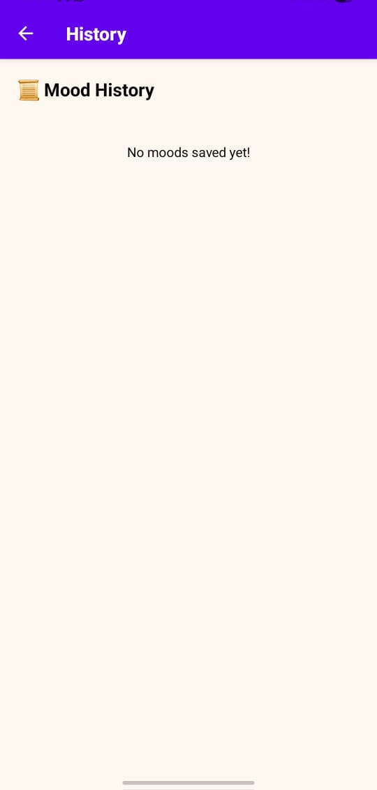

# 🌈 MoodMate – Your Daily Emotional Companion

*MoodMate* is a beautifully crafted, dark/light-themed mobile app built with *React Native + Expo* that helps users track their moods, reflect on emotional patterns, and feel motivated. From emojis to analytics — MoodMate makes emotional wellness both insightful and fun.

---

## 📸 App Screenshots

Here are some in-app previews of *MoodMate*:

<p align="center">
  
  
  
  <br/>
  
  
</p>

---

## 📲 Download the App (APK)

Click below to download and install the latest version:

**👉 [Download APK](https://expo.dev/accounts/prince6387801115/projects/mood-mate/builds/0de8c8ad-1097-46b7-9a6d-c808c6e96c6e)**  
> *(Replace this link with your actual Expo build URL)*

---

# 👥 Project Collaborator

| Name           | GitHub                                     | Email                             | Registration No
|----------------|---------------------------------------------|-----------------------------------|------------------------------|
| Prince Yadav   | [@prince6387](https://github.com/prince6387) | theprinceyadav3132@gmail.com    |12206280
| Gautam Sharma  | [@gautamsharma8](https://github.com/Gautamsharma8) |gautam.sharma5217@gmail.com|12216496
| Aditya Jaiswal | [adityajais3](https://github.com/adityajais3) |Adityajaiswallis3@gmail.com|12216462

## ✨ Features

- 😄 *Emoji-Based Mood Logging*
- 📝 *Optional Mood Notes*
- 📊 *Analytics Dashboard* with graphs & trends
- 🔁 *Mood History Timeline*
- 💬 *Motivational Quotes* (coming soon!)
- 🌗 *Dark/Light Theme Toggle*
- 🎉 *Celebration Sound & Confetti Animation*
- 📱 *Responsive UI with smooth transitions*

---

## 🛠 Tech Stack

- *Framework*: React Native + Expo
- *Navigation*: React Navigation
- *Storage*: AsyncStorage
- *Charts*: react-native-chart-kit
- *Audio*: expo-av
- *Animations*: Lottie, react-native-confetti-cannon

---

## 🚀 Getting Started (For Developers)

### 1. Clone the Repository

```bash
git clone https://github.com/prince6387/mood-mate.git
cd mood-mate
